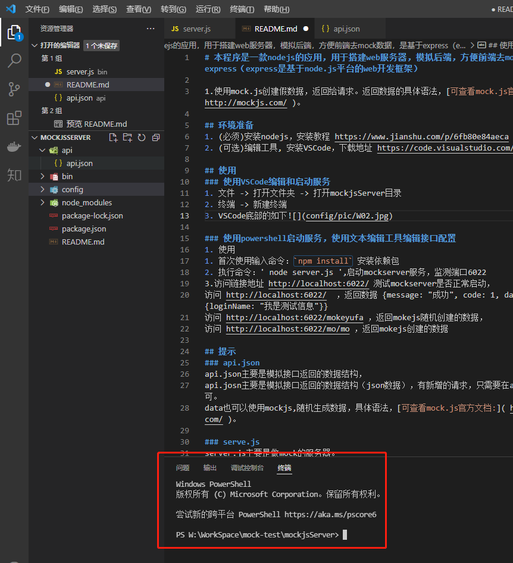
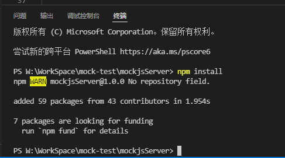
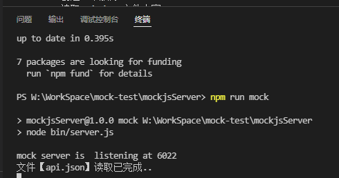
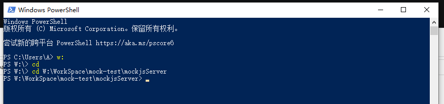
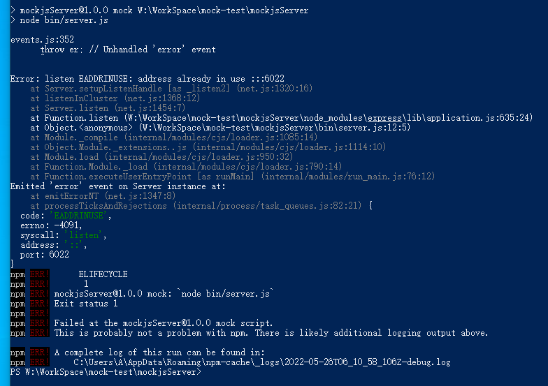

### 本程序是一款nodejs的应用，用于搭建web服务器，模拟后端，方便前端去mock数据，是基于express（express是基于node.js平台的web开发框架）

## 环境准备
1. (必须)安装nodejs，安装教程 https://www.jianshu.com/p/6fb80e84aeca
2. (可选但建议)编辑工具, 安装VSCode，下载地址 https://code.visualstudio.com/

## 启动服务
### 使用VSCode编辑和启动服务
1. 文件 -> 打开文件夹 -> 打开mockjsServer目录
2. 终端 -> 新建终端
3. VSCode底部的如下
4. 首次使用时, 终端中输入命令`npm install`, 然后回车安装服务依赖, 成功如下
5. 终端中输入命令`npm run mock`, 然后回车启动mock服务, 成功如下
6. 参考`使用说明`编写接口配置
7. 如何停止服务： ctrl + c, 然后输入y回车

### 使用powershell启动服务，使用文本编辑工具编辑接口配置
1. 打开windows系统自带的命令行工具powershell, 最好不要用cmd(没验证过)
2. 切换到mockjsServer目录, 注意先切磁盘再切目录, 如图
3. 首次使用时, powershell中输入`npm install`, 然后回车安装服务依赖, 成功参考上节图片
4. powershell中输入命令`npm run mock`, 然后回车启动mock服务, 成功参考上节图片
5. 参考`使用说明`编写接口配置
6. 如何停止服务： ctrl + c, 然后输入y回车

## 使用说明
### 增加或修改接口配置
1. 服务启动后, 在mockjsServer\api目录中增加`*.json`文件, 文件中编写接口配置
2. `*.json`命名建议全英文, 使用姓名全拼
3. mockjsServer服务启动后可自动识别mockjsServer\api中多个`*.json`文件的数量和内容变化，并且自动加载接口配置，即服务启动后只编辑`*.json`文件即可
4. 接口地址为 `http://localhost:6022/ + json文件中配置的url地址`
### `*.json`文件编写说明
```
{  
  // 两种编写方式
  // 1.key的value是一组接口配置  
  "key":[{              // key的命名随意，可以是key1、key2 也可以与url的值相同
    "url": "/login1",   // 接口地址 "url"是关键字不允许修改，冒号后面的value依据实际情况修改
    "res": 对象或数组等  // 接口返回参数配置 "res"是关键字不允许修改，冒号后面的value依据实际情况修改
  },{
    "url": "/login2",   // 接口地址
    "res": 对象或数组等  // 接口返回参数配置
  }],  
  // 2.key2的value是一个接口配置  
  "key2": {
    "url": "/login3",   // 接口地址
    "res": 对象或数组等  // 接口返回参数配置
  }  
}
```
注意：
1. key的命名：多个json文件内的key不允许重复，重复不影响使用，但会被覆盖，建议与url的value一致
2. url和res是关键字，不要修改。但是冒号`:`后面的value依据实际情况修改
3. api.json中还有desc，这只是个描述属性，没有用
4. 如果使用powershell运行，那么修改json文件时注意json文件编码格式一定要用`UTF-8`
5. res使用mockjs随机生成数据，具体语法，[可查看mock.js官方示例文档:]( http://mockjs.com/examples.html )

## 常见问题
### 1. 端口占用
   使用powershell启动服务后直接点击X关闭pwershell后nodejs服务其实还在运行(遇到过，但不常见)，再次启动可能会出现如图错误
#### 解决方式
   任务管理器结束Node.js JavaScript Runtime进程，powershell没有关闭的情况下他会在Windows PowerShell下，powershell关闭时是个独立的进程
### 2. powershell启动服务，修改json不生效
powershell启动服务后，编辑*.json文件未生效，因为windows的cmd和powershell默认会开启`快速编辑模式`，当在命令窗口内误输入字符时会切换到编辑模式阻塞当前服务
#### 解决方式
   1. powershell 标题点右键`属性`，选项中选择关闭快速编辑，确定
   2. 在powershell的窗口中点击左键，然后回车，这就解除了阻塞
   3. 建议大家使用VSCode
## 最后，一定要注意JSON编码格式为UTF-8，虽然我没有试过GBK,ANSI（记事本）别的。但UTF-8拯救万物
   